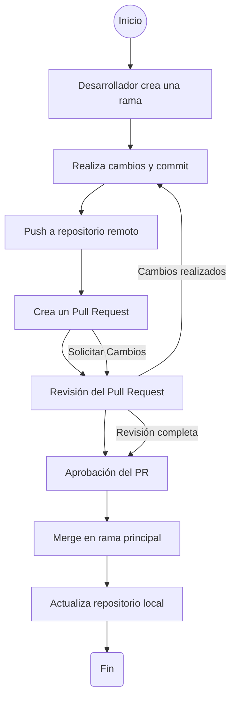

# Diagrama Pull Request

```mermaid
flowchart TD
    X((Inicio)) --> A[Desarrollador crea una rama]
    A --> B[Realiza cambios y commit]
    B --> C[Push a repositorio remoto]
    C --> D[Crea un Pull Request]
    D --> E[Revisión del Pull Request]
    E --> F[Aprobación del PR]
    F --> G[Merge en rama principal]
    G --> H[Actualiza repositorio local]
    H --> I(Fin)
    
    D -->|Solicitar Cambios| E
    E -->|Cambios realizados| B
    E -->|Revisión completa| F
```
